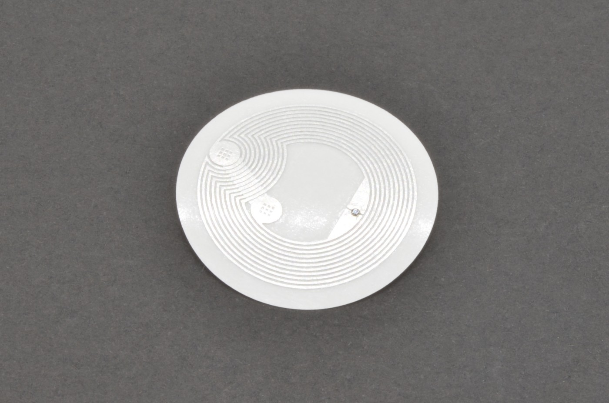
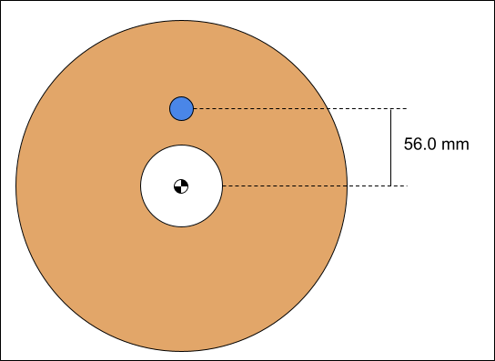

# OpenTag3D Standards

Current Version: {{ site.data.spec.version }}

## Hardware Standard

The OpenTag3D standard is designed for the NTAG213/215/216 13.56MHz NFC chips. These tags are cheap and common, and have plenty of space to store the required information. NFC tags can be read/written with smartphones. 13.56 MHz RFID modules are plentiful, low-cost and Arduino-compatible, allowing for easy integration.

| Tag Type | Capacity  | Compatibility   |
| -------- | --------- | --------------- |
| NTAG213  | 144 bytes | Core            |
| NTAG215  | 504 bytes | Core + Extended |
| NTAG216  | 888 bytes | Core + Extended |

NFC NTAG213/215/216 was chosen over MIFARE 1K Classic tags, which is what the Bambu Lab AMS uses, for the following reasons:

- Smartphone Support: NTAG213/215/216 can be read from smartphones, while MF1K requires a dedicated reader
- Backwards Compatible: The RFID hardware used for reading MF1K tags typically supports NTAG tags as well
- Non-Encrypted: MF1K uses 25% of its memory to encrypt the data, which is unsuitable for an open source standard

Originally, the NTAG216 was specifically selected as it had more usable memory (888 bytes) than the MF1K (768 bytes). However, it was later determined that the core data required for functionality could be stored within 144 bytes, and additional data could be stored within 504 bytes.

## Mechanical Standard

The NFC tags should be placed on the spools as follows:

- The center should be 56.0mm away from the center of the spool (see pic)
- The tag should never be more than 4.0mm away from the external surface of the spool
  - For spool sides thicker than 4mm, there must be a cutout to embed the tag, or the tag should be fixed to the outside of the spool
- Two tags should be used, one on each end of the spool, directly across from each other

## Data Structure Standard

This is a list of data that will live on the RFID chip, separated into required and optional data. All **REQUIRED** data must be populated to be compliant with this open source RFID protocol.

NTAG213 tags have 144 bytes of usable memory, which is the minimum requirement for OpenTag3D. NTAG216 tags have 888 bytes of usable memory.

All strings are UTF-8 unless specified otherwise. All integers are unsigned, big endian, unless specified otherwise.

Temperatures are stored in Celsius, divided by 5.

### Memory Map - OpenTag3D Core

This is designed to fit within 144 bytes (address 0x10-0x9F), which is for NTAG213, the smallest and cheapest variant of compatible tags.



### Memory Map - OpenTag3D Extended

This is additional data that not all manufacturers will implement, typically due to technological restrictions.

These fields should be populated if available. All unused fields must be populated with "-1" (all 1's in binary, eg 0xFFFFFFFFFFFFFFFF).

This memory address starts at address 144, which is just outside the range of NTAG213.



### Web API Standard

Some tags can contain extended data that doesn't fit or doesn't belong on the RFID tag itself. One example is a diameter graph, which is too much data to be stored within only 888 bytes of memory.

These complex variables can be looked up using the "web API" URL that is stored on the RFID tag.

The format of this data should be JSON.

The web API has not yet been defined for OpenTag3D, as the exact contents of this data are still open to discussion.

## Previous Considerations

These are topics that were heavily discussed during the development of OpenTag3D. Below is a quick summary of each topic, and why we decided to settle on the standards we defined.

- NTAG vs MIFARE
  - NTAG213/215/216 is compatible with smartphones
  - NTAG216 has slightly more usable memory than MIFARE tags
  - MIFARE uses about 25% of memory to encrypt data, preventing read/write operations, which is not applicable for OpenTag3D because of the open-source nature
  - The hardware used for reading MIFARE tags is typically compatible with NTAG tags, meaning existing RFID printer hardware would not need replacement
- JSON vs Memory Map
  - Formats such as JSON (human-readable text) take up considerably more more memory than memory mapped
    - For example, defining something like Printing Temperature would be `PrintTemp:225` which is 13 bytes, instead of storing a memory mapped 2-byte number. Tokens could be reduced, but that also defeats the purpose of using JSON in the first place, which is often for readability
  - NTAG216 tags only have 888 bytes of usable memory, and NTAG213 tags only have 144 bytes, which would be eaten up quickly
    - With memory mapping, the core data was able to easily fit in 144 bytes
- Lookup Tables
  - OpenTag3D does NOT use lookup tables, which would be too difficult to maintain due to the decentralized nature of this standard
  - Lookup tables can quickly become outdated, which would require regular updates to tag readers to make sure they've downloaded the most recent table
  - Storing lookup tables consumes more memory on the device that reads tags
  - On-demand lookup (via the internet) would require someone to host a database
    - Hosting this data would have costs associated with it, and would also put the control of the entire OpenTag3D format in the hands of a single person/company
  - Rather than representing data as a number (such as "company #123 = Example Company), the plain-text company name should be used instead
