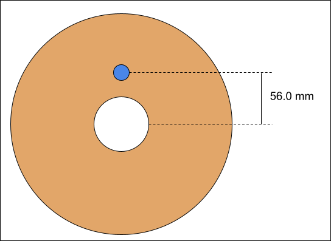

# OpenTag3D Standard

Current Version: {{ site.data.spec.version }}

## Hardware Standard

The OpenTag3D standard is designed to work on any NFC tag that is compliant with the ISO/IEC 14443 Type A communication protocol, is compatible with NDEF Type 2, and has at least 144 bytes of writable capacity. These kinds of tags are plentiful and can be read and written with smartphones and PN532 modules, making them low-cost and easy to integrate.

In particular, the standard is tailored towards the NTAG213/215/216 13.56MHz NFC chips. These tags are cheap and common, and have plenty of space to store all of the required and optional information. SLIX2 tags were later added as a compliant option.

| Tag Type | Capacity  | Usable Capacity | Compatibility   |
| -------- | --------- | --------------- | --------------- |
| NTAG213  | 144 bytes | 111 bytes       | Core            |
| SLIX2    | 320 bytes | 287 bytes       | Core + Extended |
| NTAG215  | 504 bytes | 471 bytes       | Core + Extended |
| NTAG216  | 888 bytes | 835 bytes       | Core + Extended |


### NTAG vs. MIFARE 1K Classic

NFC NTAG213/215/216 was chosen over MIFARE 1K Classic tags, which is what the Bambu Lab AMS uses, for the following reasons:

- Smartphone Support: NTAG213/215/216 can be read from smartphones, while MF1K requires a dedicated reader
- Backwards Compatible: The RFID hardware used for reading MF1K tags typically supports NTAG tags as well
- Non-Encrypted: MF1K uses 25% of its memory to encrypt the data, which is unsuitable for an open source standard

> [!NOTE]
> Originally, the NTAG216 was specifically selected as it had more usable memory (888 bytes) than the MF1K (768 bytes). However, it was later determined that the core data required for functionality could be stored within 144 bytes, and extra data could be stored within at little as 320 bytes. So, the NTAG213, SLIX2 and NTAG215 were added as cheaper spec-compliant options.

## Mechanical Standard

The NFC tags should be placed on the spools as follows:

- The center should be 56.0mm away from the center of the spool (see pic)
- The tag should never be more than 4.0mm away from the external surface of the spool
  - For spool sides thicker than 4mm, there must be a cutout to embed the tag, or the tag should be fixed to the outside of the spool
- Two tags should be used, one on each end of the spool, directly across from each other



## Data Structure Standard

The data is to be stored as a payload within an NDEF record of MIME type `{{ site.data.spec.mime_type }}`. The data must remain unencrypted to be compliant with the spec.

NTAG213 tags have 144 bytes of writable memory, which is the minimum requirement for OpenTag3D Core. SLIX2 tags have 320 bytes of writable memory, which is the minimum requirement for OpenTag3D Extended.

All strings are UTF-8 unless specified otherwise. All integers are unsigned, big endian, unless specified otherwise.

Temperatures are stored in Celsius, divided by 5.

Below is list of data that will live on the RFID chip. All **REQUIRED** data must be populated to be compliant with the spec.

### Memory Map - OpenTag3D Core

This is designed to fit within the 144 bytes of writable space on the NTAG213, the smallest and cheapest variant of compatible tags.



### Memory Map - OpenTag3D Extended

This is additional data that not all manufacturers will implement, typically due to technological restrictions. These fields should be populated if available.

This memory address starts just outside the range of NTAG213; an SLIX2 or larger must be used to store this data.



### Web API Standard

Sometimes a filament manufacturer may want to include supplemental data for advanced users that doesn't fit or otherwise cannot be stored on the RFID tag itself. One example is a diameter graph, which is too much data to be stored within only 888 bytes of memory. OpenTag3D defines a field for a "web API" URL which can be used to look up this information.

> [!NOTE]
> The web API will only be used for advanced supplemental data, or data that requires an internet connection to use anyways, and will **NEVER** be used for critical information required by printers in order to print the material properly.

The "Online Data URL" field should be populated with the URL that responds with the web API data. The URL must return JSON data when the `Accept` HTTP header is set to `application/json`. Implementers are welcome to create a user-friendly UI if the `Accept` header is set to anything else, but it _must_ return JSON format if the client calls for it.

The URL should respond with JSON formatted like the following:

```json
{
  "opentag_version": "{{ site.data.spec.version }}",
  "price": {
    "us": "$15.99",
    "eu": "€14.99",
    "uk": "£16.99",
    "global": "$15.99"
  },
  "product_url": {
    "us": [
      "https://www.amazon.com/dp/*",
      "https://example.com/filament-manufacturer-website"
    ],
    "eu": ["https://example.com"]
  }
}
```

The `opentag_version` must be set as the current OpenTag3D version the API has been updated to support.

The `price` field should be the current prices for the material and color, separated by country or region. Each country or region should be represented by its two-letter ISO 3166-1 code, including any exceptional reservations such as EU for European Union. A `global` area may be defined as well.

The `product_url` field should be links to product pages where the user can repurchase the filament, separated by country or region. The representations of countries/regions will be identical to that of the `price` field. For each country/region, a list of URLs may be specified in order to provide multiple places the user can buy new filament. The order of URLs may be specified however the filament maker desires. (Implementers should honor the filament maker's ordering.)

## Reader Implementation Guidelines

While every implementation for reading OpenTag3D RFID tags will be different, this specification aims to set a few requirements to ensure that functionality is consistent across printers and other hardware -- we'll call these the "reader" for continuity.

When attempting to read an RFID tag, the reader should check for an NDEF record of the type `{{ site.data.spec.mime_type }}`. This record will include all of the tag data. It may ignore any other NDEF records. If there is no `{{ site.data.spec.mime_type }}` record, it is not an OpenTag3D tag.

The reader should then check the tag version. If the tag version is a newer _minor_ version than the reader expects, display a warning to the user and attempt to parse anyways. If the tag version is a newer _major_ version, the reader should display an error to the user and not attempt to parse the data.

## Branding Guidelines

Adding the OpenTag3D logo or any OpenTag3D branding is entirely optional, but is recommended to show that your filament or hardware uses or supports the OpenTag3D specification. With that said, if you decide to include OpenTag3D branding, there are a few guidelines on how to do so.

When including OpenTag3D branding, you may:

- Include either variation of logo in printed or digital media
- Change the logo color as desired (although black or white is recommended)
- Specify the name in plain text in place of the logo
- _Slightly_ modify the logo for thematic effect (such as adding drips to fit branding)

You may NOT:

- Crop, scale, warp, flip or otherwise distort the logo
- Heavily modify the logo, such as changing the font used
- Use the logo or OpenTag3D name to imply endorsement of your product

OpenTag3D has both full-size and small logos available:

[](./assets/images/logo-small.svg)\| [](./assets/images/logo.svg)

## Previous Considerations

These are topics that were heavily discussed during the development of OpenTag3D. Below is a quick summary of each topic, and why we decided to settle on the standards we defined.

- NTAG vs MIFARE 1K Classic
  - NTAG213/215/216 and SLIX2 tags are easy to source
  - NTAG216 has slightly more usable memory than MIFARE tags
    - This was later determined to not be important, as the core data could be fit within significantly less capacity
  - MIFARE 1K Classic uses about 25% of memory to encrypt data, preventing read/write operations, which is not applicable for OpenTag3D because of the open-source nature
  - The hardware used for reading MIFARE 1K Classic tags is typically compatible with NTAG/SLIX2 tags, meaning existing RFID printer hardware would not need replacement
    - In contrast, smartphones can't typically read MIFARE 1K Classic tags
- JSON vs Memory Map
  - Formats such as JSON (human-readable text) take up considerably more memory than memory mapped
    - For example, defining something like Printing Temperature would be `PrintTemp:225` which is 13 bytes, instead of storing a memory mapped 2-byte number. Tokens could be reduced, but that also defeats the purpose of using JSON in the first place, which is often for readability
  - NTAG216 tags only have 888 bytes of usable memory, and NTAG213 tags only have 144 bytes, which would be eaten up quickly
    - With memory mapping, the core data was able to easily fit in 144 bytes
- Lookup Tables
  - OpenTag3D does NOT use lookup tables, which would be too difficult to maintain due to the decentralized nature of this standard
  - Lookup tables can quickly become outdated, which would require regular updates to tag readers to make sure they've downloaded the most recent table
  - Storing lookup tables consumes more memory on the device that reads tags
  - On-demand lookup (via the internet) would require someone to host a database
    - Hosting this data would have costs associated with it, and would also put the control of the entire OpenTag3D format in the hands of a single person/company
  - Rather than representing data as a number (such as "company #123 = Example Company"), the plain-text company name should be used instead
